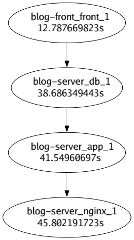

# godg
Graphical representation of docker container startup order


# Example


# Install

```
go install github.com/masibw/godg@latest
```

# Usage
First, run godg to monitor docker container.
```
godg
```
Then you start up the docker container that you want to check start order.
After monitoring time, you can access the `start-up.png` that represents start up order.

If you want longer wait time, you can specify the time by -t flag.
```
godg -t 2m
```

